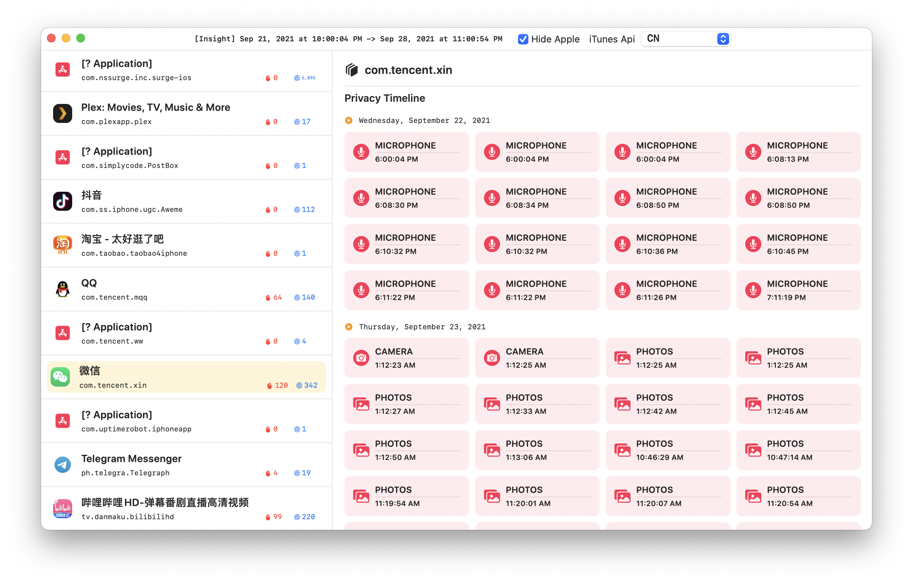

# Insight

Read iOS 15 privacy insight '.ndjson' file into your human brain. Written in SwiftUI.

## Feature

- [x] Compile records into app summary
- [x] Relink app info from App Store
- [ ] Filter & Search
- [ ] Export Report
- [ ] Embed SwiftCharts

## Disclaimer

This app reimplements the functionality from @laosbxd [(see more)](https://twitter.com/laosbxd/status/1440375461477949442), but I wrote the code on my own for research purpose.

## License

Insight is licensed under [MIT](./LICENSE). App library license are included in their own git repository.

---

Copyright © 2021 Lakr Aream. All Rights Reserved.